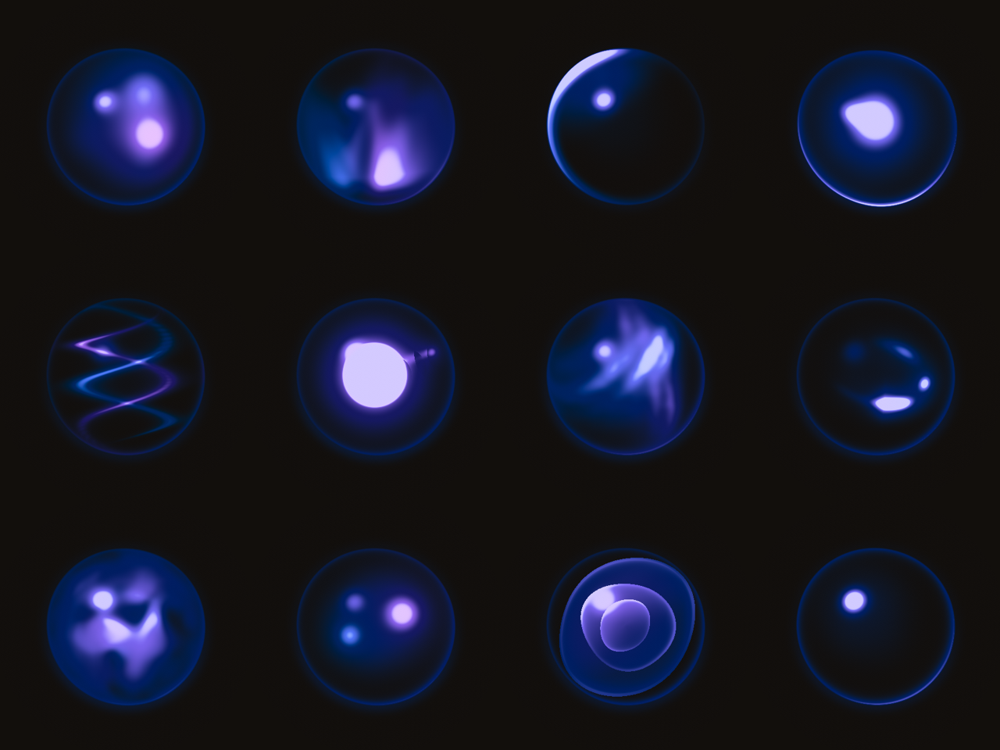
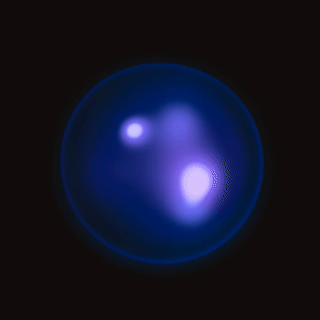
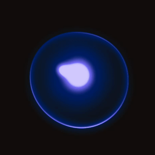
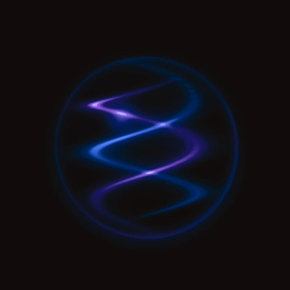

# Murmur

Responsive AI presences for SwiftUI. Volumetric glass orbs, rendered in Metal, that work with your app.



| opal | droplet | helix |
|---|---|---|
|  |  |  |

- **18 glass species** (aura, droplet, limn, comet, nebula, prism, duet, still, fathom, arc, opal, flux, tempest, helix, geode, sol, abyss, chorus) plus a 48-species archive
- **6 states**: idle, listening, thinking, responding, success, error, with designed transitions
- **Live signals**: `level` (voice) and `activity` (typing / token stream) move the material
- **Gyro parallax, duotone, light mode, haptics** built in
- One SwiftUI view, no assets, no videos, ~60 fps

## Install

```swift
.package(url: "https://github.com/krispuckett/murmur", from: "0.1.0")
```

## Use

```swift
import Murmur

// Chat pill
MurmurPill(MurmurConfiguration(style: .aura))

// Bare orb, any size
MurmurView(MurmurConfiguration(style: .limn), state: .thinking)
    .frame(width: 46, height: 46)

// Voice orb
MurmurView(config, state: .listening,
           signals: MurmurSignals(level: micLevel, activity: tokenRate))
```

- Every dial is per state: `config.states[.thinking]?.speed = 1.4`
- Colors: `config.ink`, `config.tone`, optional `config.tone2` duotone
- Configurations are Codable; save them, ship them, send them over the wire

## The Lab

- Open `Lab/MurmurLab.xcodeproj`, run on iPhone
- Pick a species, drag the dials, tap states, feed it the voice demo
- **Export** copies an agent-ready prompt; paste it to your coding agent
- **Still** renders a 1024 px frame for icons and marketing

## Agents

See [AGENTS.md](AGENTS.md) for drop-in instructions written for coding agents.

## Requirements

- Package: iOS 17+ / macOS 14+
- Lab app: iOS 26+

MIT license.
